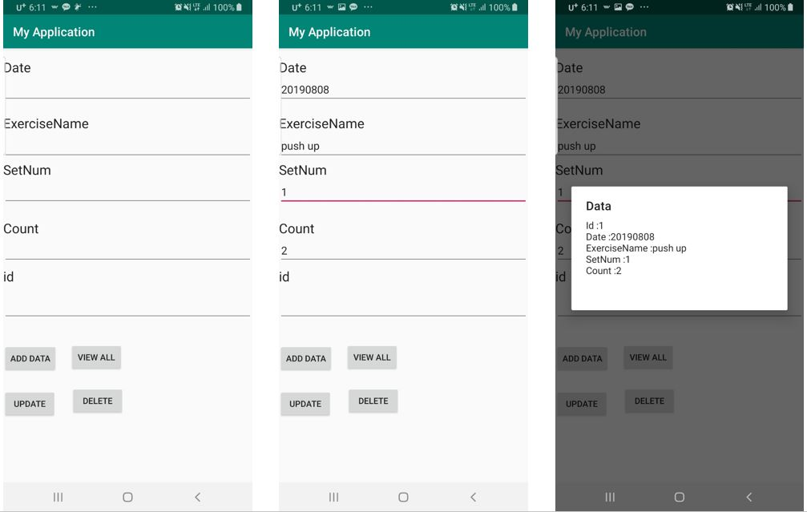

**NFC Tags** are an application of RFID technology. Unlike most RFID, which makes an effort to give a long reading range, NFC deliberately limits this range to only a few inches or almost touching the phone to the Tag. 
  

**Radio-frequency identification (RFID)** uses electromagnetic fields to automatically identify and track tags attached to objects. An RFID tag consists of a tiny radio transponder; a radio receiver and transmitter. When triggered by an electromagnetic interrogation pulse from a nearby RFID reader device, the tag transmits digital data, usually an identifying inventory number, back to the reader. 
 
RFID tags are made out of three pieces: a micro chip (an integrated circuit which stores and processes information and modulates and demodulates radio-frequency (RF) signals), an antenna for receiving and transmitting the signal and a substrate. The tag information is stored in a non-volatile memory. The RFID tag includes either fixed or programmable logic for processing the transmission and sensor data, respectively.

(From Wikipedia)

# Source Code
This is an example of using adroid SQLite DB.
[Github_source_code](https://github.com/Yejikim93/AndroidSQLite)

