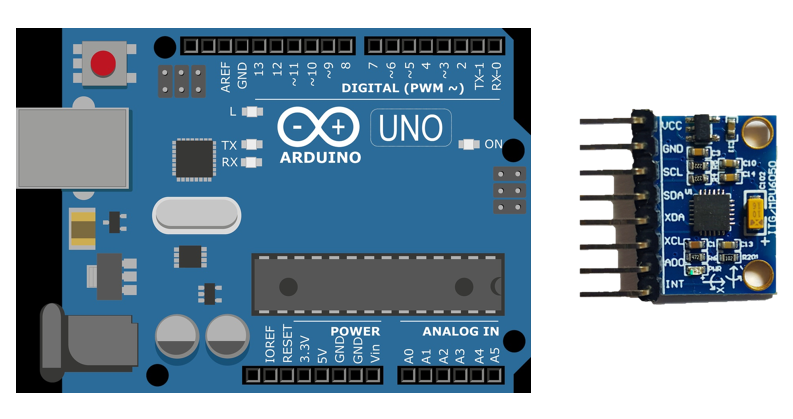

# Information

- 가속도&자이로 센서 구입 - [메카솔루션](http://mechasolution.com/shop/main/index.php) 
- Accelerometer + Gyro sensor : MPU6050 (6-Axis) [센서 사양 및 라이브러리 설치](http://mechasolution.com/shop/goods/goods_view.php?goodsno=6&category=)
- Arduino download [download site](https://www.arduino.cc/en/Main/Software) 

# Connection 
 

Arduino UNO----->MPU6050  
`5V` --------------------> `VCC`     
`GND` -------------------> `GND`     
`A4` --------------------> `SCL`     
`A5` --------------------> `SDA`    

# Code 

      #include <Wire.h> 

      const int MPU=0x68;//MPU6050 I2C Address  
      int AcX,AcY,AcZ,Tmp,GyX,GyY,GyZ; 
      void get6050(); 
      
      void setup(){ 
      
         Wire.begin(); 
         Wire.beginTransmission(MPU); 
         Wire.write(0x6B); 
         Wire.write(0);//MPU6050 -'Waiting action mode' 
         Wire.endTransmission(true); 
      } 
        
      void loop(){ 
      
         get6050();//Update sensor data 
      
         //Print in Serial Monitor 
         Serial.println(Acx); // choose what I want to print <- AcX/AcY/AcZ/GyX/GyY/GyZ  
      } 
      
         delay(10); // delay time 
      } 
      
      void get6050(){ 
         Wire.beginTransmission(MPU);//MPU6050 호출  
      
         Wire.write(0x3B);//AcX 레지스터 위치 요청
      
         Wire.endTransmission(false);
      
         Wire.requestFrom(MPU,14,true);//14byte의 데이터를 요청
      
         AcX=Wire.read()<<8|Wire.read();//두개의 나뉘어진 바이트를 하나로 이어붙입니다.
      
         AcY=Wire.read()<<8|Wire.read();
      
         AcZ=Wire.read()<<8|Wire.read();
      
         Tmp=Wire.read()<<8|Wire.read();
      
         GyX=Wire.read()<<8|Wire.read();
      
         GyY=Wire.read()<<8|Wire.read();
      
         GyZ=Wire.read()<<8|Wire.read();
      
       }
       
# Reference
[http://www.makeshare.org/bbs/board.php?bo_table=arduinosensor&wr_id=47](http://www.makeshare.org/bbs/board.php?bo_table=arduinosensor&wr_id=47)

