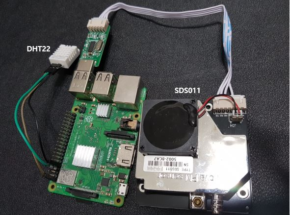

 

# DHT22 

## Connection 
 

## installing 

    # Module 설치
  
    git clone https://github.com/adafruit/Adafruit_Python_DHT.git
    [git 이 설치되어 있지 않은경우 sudo apt-get install git]
    cd Adafruit_Python_DHT
    sudo apt-get update
    sudo apt-get install build-essential python-dev python-openssl
    sudo python setup.py install

    # 실행 py 언어 (temp.py) 로 저장

    import Adafruit_DHT as dht
    import datetime

    wtime = datetime.datetime.now()
    h,t = dht.read_retry(dht.DHT22, 4)
    print wtime, 'Temp={0:0.1f}*C  Humidity={1:0.1f}%'.format(t, h) 

    # 작동여부 Test
    sudo python temp.py
    예) 2016-02-17 20:40:02.125806 Temp=22.4*C  Humidity=34.6%

    Crontab 실행 후 아래 입력
    crontab -e

    #예제1 - 매 10분마다 온도를 기록
    */10 * * * * sudo python /var/www/html/temp.py >> /var/www/html/temp.txt
    
    
# SDS011

## installing

    1. Git 에서 파이썬 스크립트 받아오기 
    $ git clone https://github.com/zefanja/aqi.git
    
    2.해당 스크립트를 열고 자신이 원하는 설정으로 변경 
     vi ./aqi/phython/aqi.py
     
    3. 수행 
    3-1. json  파일 비어있기 때문에 생성해줘야됨
    $  sudo mkdir -p /var/www/html
    $ sudo chown pi:pi /var/www/html
    $ echo [] > /var/www/html/aqi.json
    $ ./aqi/python/aqi.py
    
    4. json 파일 확인
    $ cat /var/www/html/aqi.json
    
# Reference 
[https://nonaka.tistory.com/171](https://nonaka.tistory.com/171)
[https://blog.heeseop.com/122](https://blog.heeseop.com/122)
[https://m.blog.naver.com/alkydes/220792520374](https://m.blog.naver.com/alkydes/220792520374)
    
     
