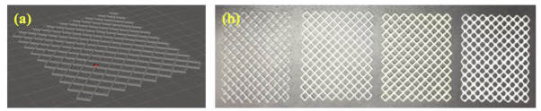
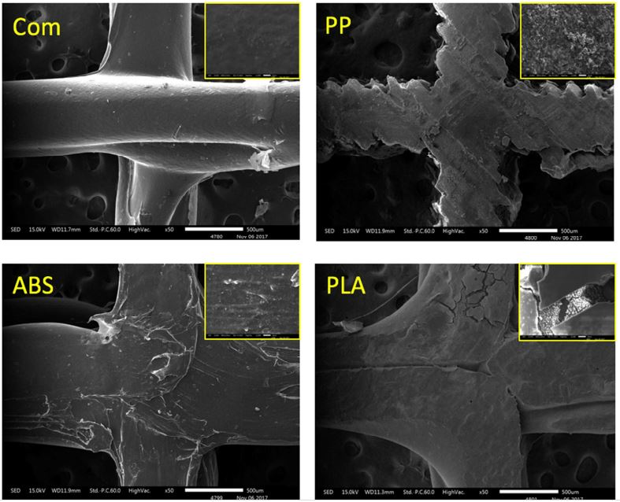
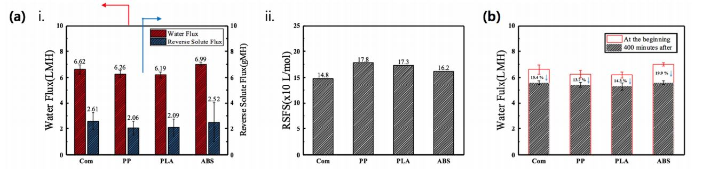
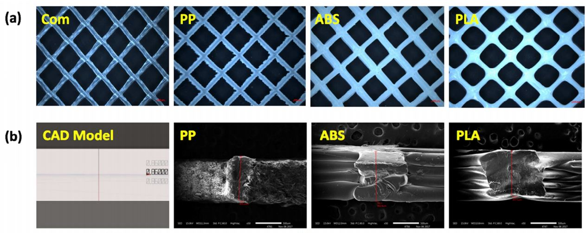

This research was performed using acrylonitrile butadiene styrene (ABS), polypropylene (PP), and natural polylactic acid (PLA) as printing material, and the spacer model was produced using a diamond-shaped feed spacer, with a commercially available product as a reference.

###  3D spacer model

To design the 3D spacer model, Autodesk Meshmixer and Blender were used as CAD software with spacer dimensions of 45 mm × 55 mm × 0.86 mm (34 mil; Fig. 2(a)). 
The spacer model was designed by using a diamond-shaped commercial membrane feed spacer (made of PP) manufactured by Hydration Technologies Innovation (HTI; Albany, USA) as a reference (Fig. 2(b)).

# Abstract 
Recently, feed spacer research for improving the performance of a membrane module has adopted three-dimensional (3D) printing technology. This study aims to improve the performance of membrane feed spacers by using various materials and incorporating 3D printing. The samples were fabricated after modeling with 3D computer-aided design (CAD) software to investigate the mechanical strength, water flux, reverse solute flux, and fouling performances. This research was performed using acrylonitrile butadiene styrene (ABS), polypropylene (PP), and natural polylactic acid (PLA) as printing material, and the spacer model was produced using a diamond-shaped feed spacer, with a commercially available product as a reference. The 3D printed samples were initially compared in terms of size and precision with the 3D CAD model, and deviations were observed between the products and the CAD model. Then, the spacers were tested in terms of mechanical strength, water flux, reverse solute flux, and fouling (alginate-based waste water was used as a model foulant). Although there was not much difference among the samples regarding the water flux, better performances than the commercial product were obtained for reverse solute flux and fouling resistance. When comparing the prominent performance of natural PLA with the commercial product, PLA was found to have approximately 10% less fouling (based on foulant volume per unit area and root mean square roughness values), although it showed similar water flux. Thus, another approach has been introduced for using bio-degradable materials for membrane spacers.

# Result

## Reference 

[https://www.sciencedirect.com/science/article/pii/S0045653518305666](https://www.sciencedirect.com/science/article/pii/S0045653518305666)
