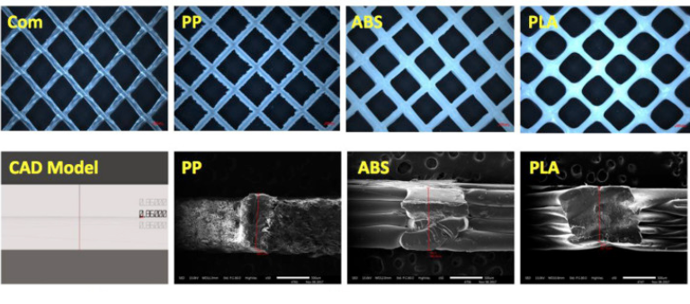

**Published:** *Yanar, N., Son, M., Yang, E., **Kim, Y.**, Park, H., Nam, S. E., & Choi, H. (2018). Chemosphere, 202, 708–715.* [DOI →](https://doi.org/10.1016/j.chemosphere.2018.03.147)

# Overview

This study evaluated **3D-printed membrane feed spacers** fabricated from three polymers (ABS, PP, natural PLA) for forward osmosis (FO) membrane modules. Performance was benchmarked against a commercial diamond-shaped spacer to assess feasibility of customizable, biodegradable alternatives for membrane separation systems.

# Key Findings

- **PLA spacers achieved ~10% less fouling** than the commercial reference (foulant volume per unit area, RMS roughness)
- PLA showed the highest **yield strength (0.433 MPa)** among tested materials
- All 3D-printed samples matched commercial water flux and improved **reverse solute flux** and **fouling resistance**
- Demonstrated feasibility of **biodegradable spacer materials** for sustainable membrane operations

# Reference

Yanar, N. et al. (2018). *Investigation of the performance behavior of a forward osmosis membrane system using various feed spacer materials fabricated by 3D printing technique.* **Chemosphere**, 202, 708–715. [https://doi.org/10.1016/j.chemosphere.2018.03.147](https://doi.org/10.1016/j.chemosphere.2018.03.147)
