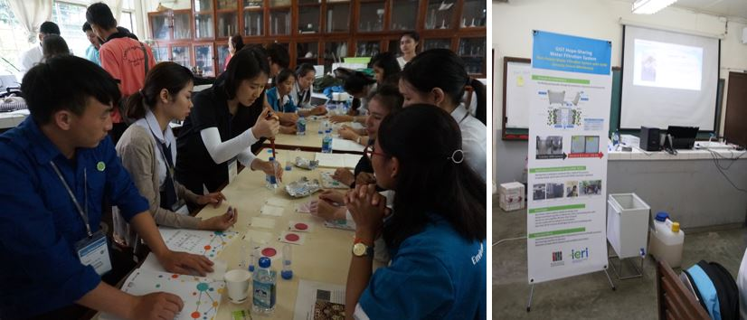
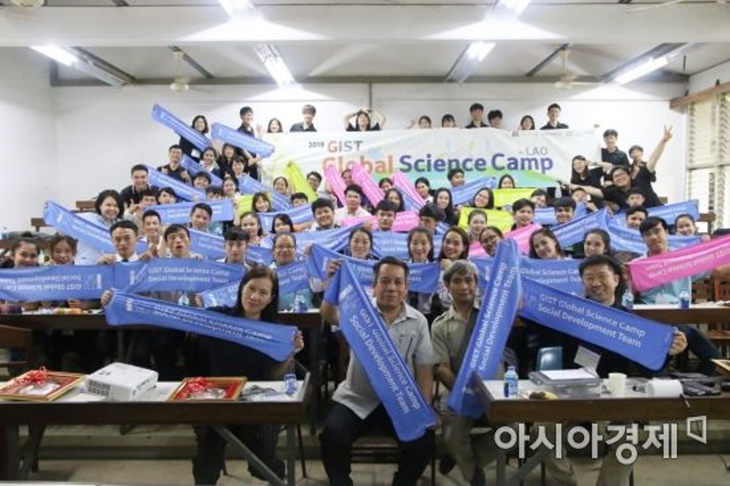

# Global Science Camp in Laos 
## Monitoring & Treatment of Mekong River and air pollution

The GIST Global Science Camp began overseas service for the first time this year and lasted for four nights and five days from the 16th to the 20th. A total of 14 team members, including GIST university students, graduate students, and researchers, left for service in Laos. About 60 students participated in the field, including 50 students from the Department of Chemical Engineering and Environmental Engineering, National University of Laos, and 10 students from the University of Cancun, Thailand.
  
The Science Camp, which focuses on social and environmental issues in Laos, has raised awareness of crisis by approaching the problems faced by students through field-oriented lectures and experiments, such as the Mekong river collection and the measurement of air pollution in the city of Vientiane. In the meantime, the program focused on experiments, which were difficult due to the absence of equipment, and provided many opportunities for experiments and exercises.
  
In the water purification experiment using the Mekong River, we demonstrated the principle of purification by demonstrating the desired water purifier developed by GIST's appropriate technology, and conducted specialized training at the International Institute of Environment for easy use in the field. Hope Water Purifier maximized the synergy effect with global social contribution projects for safe drinking water supply and health promotion.

# Reference

[https://www.asiae.co.kr/news/view.htm?idxno=2018072617512511056](https://www.asiae.co.kr/news/view.htm?idxno=2018072617512511056)
