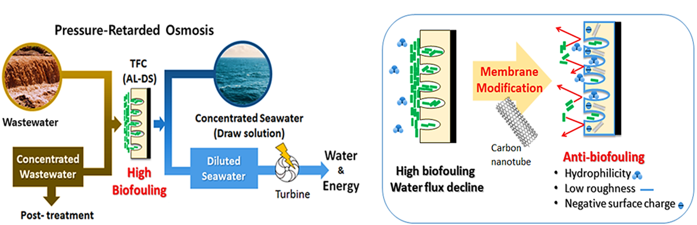
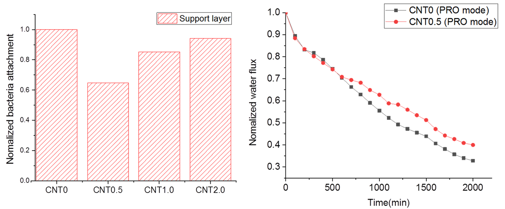
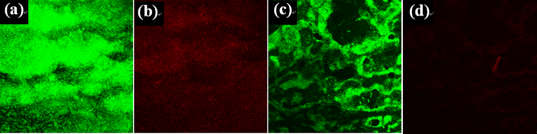

# Abstract

In this study, the anti-biofouling effect of a thin film nanocomposite (TFN) membrane with a functionalized-carbon-nanotube-blended polymeric support layer was analyzed to determine the applicability of this membrane for the pressure-retarded osmosis (PRO) process. The anti-biofouling property of TFN membranes for the PRO process was characterized by SEM, FTIR, and AFM, as well as contact angle measurements and zeta potential analysis of the bottom side of the support layer. The anti-biofouling effect of the fabricated membrane for the PRO process was analyzed by bacterial attachment tests on the bottom surface of the support layer and biofouling tests in a cross-flow operation system in the PRO mode (AL-DS). The TFN membrane with 0.5 wt% fCNTs exhibited enhanced anti-biofouling properties of the bottom surface of the support layer compared to the bare TFC membrane due to the low roughness, high negative surface charge, and hydrophilicity. Compared to the bare TFC membrane, the support layer of the fCNT0.5-TFN membrane exhibited a 35% decrease in bacterial attachment. In a laboratory-scale biofouling test, the water flux of the fCNT0.5-TFN membrane was ∼10% less than that of the bare TFC membrane in the PRO mode.

# Result

### Contact angle measurement of the support layer of the fabricated membrane.&Comparison of the biofouling flux decline of the bare TFC membrane and CNT0.5 TFN membrane in the PRO mode.
 

### Orthogonal view of the confocal laser scanning microscopy(CLSM) image of the biofouled layers on CNT0/CNT0.5 membrane in the PRO mode: (a and b) CNT0 membrane/(c and d) CNT0.5 membrane and (a and c) live bacteria on membrane/(b and d) dead bacteria on the membrane.

## Reference:
[https://pubs.rsc.org/en/content/articlelanding/2020/ra/c9ra08870a#!divAbstract](https://pubs.rsc.org/en/content/articlelanding/2020/ra/c9ra08870a#!divAbstract)

