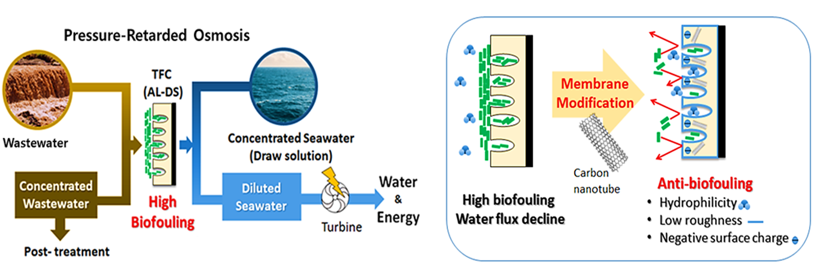
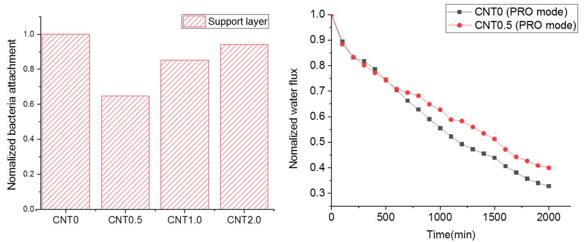

**Published:** *<b>Kim, Y.</b>, Yang, E., Park, H., & Choi, H. (2020). RSC Advances, 10(10), 5697–5703.* [DOI →](https://doi.org/10.1039/C9RA08870A)

# Overview

This work developed and evaluated a thin-film nanocomposite membrane with a **functionalized-carbon-nanotube-blended support layer** to mitigate biofouling in the pressure-retarded osmosis (PRO) process — a critical issue limiting long-term operation of osmotic membrane systems.

# Approach

- Engineered the support-layer composition to control surface roughness, charge, and hydrophilicity
- Characterized membrane surface via **SEM, FTIR, AFM, contact angle, and zeta potential** measurements
- Tested membrane performance under cross-flow PRO mode (AL-DS) with bacterial attachment and biofouling assays

# Key Findings

- **~35% reduction** in bacterial attachment on the modified membrane vs. the bare TFC reference
- Only **~10% water flux loss** during long-term biofouling testing in PRO mode
- Improvement attributed to **lower surface roughness, higher negative surface charge, and increased hydrophilicity**

# Reference

**Kim, Y.**, Yang, E., Park, H., & Choi, H. (2020). *Anti-biofouling effect of a thin film nanocomposite membrane with a functionalized-carbon-nanotube-blended polymeric support for the pressure-retarded osmosis process.* **RSC Advances**, 10(10), 5697–5703. [https://doi.org/10.1039/C9RA08870A](https://doi.org/10.1039/C9RA08870A)
