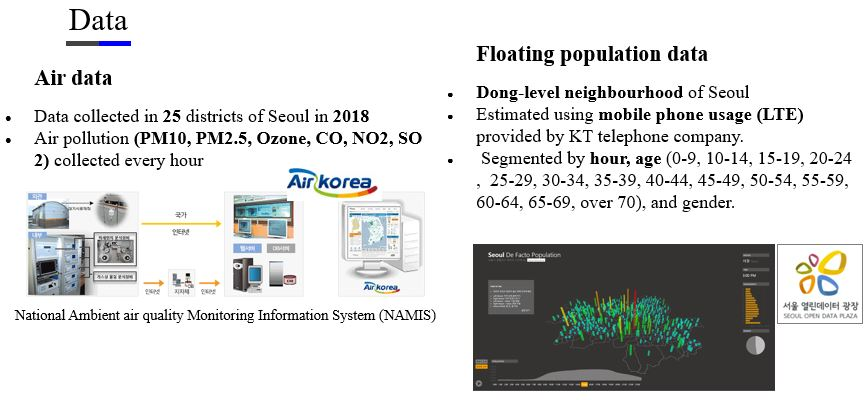
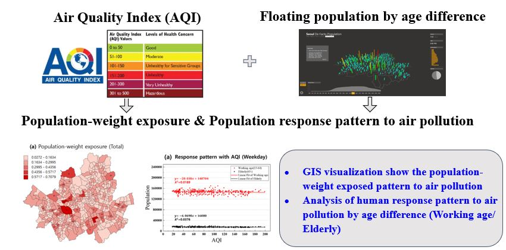
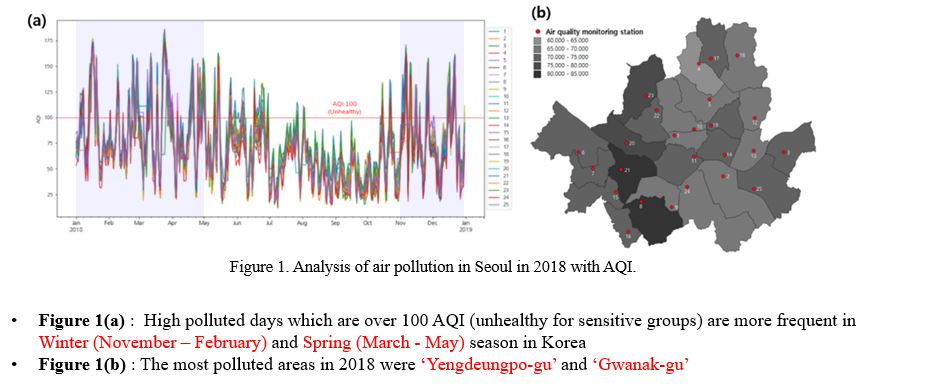
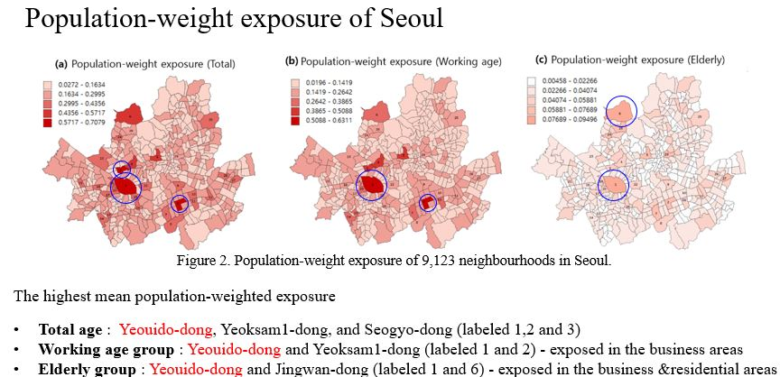
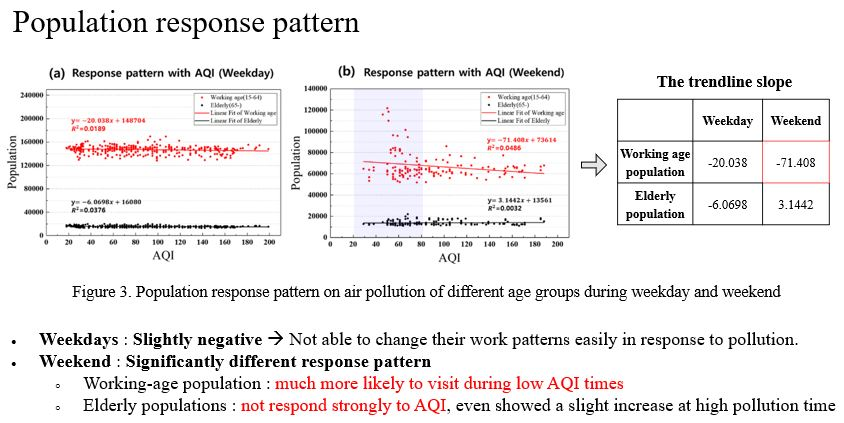
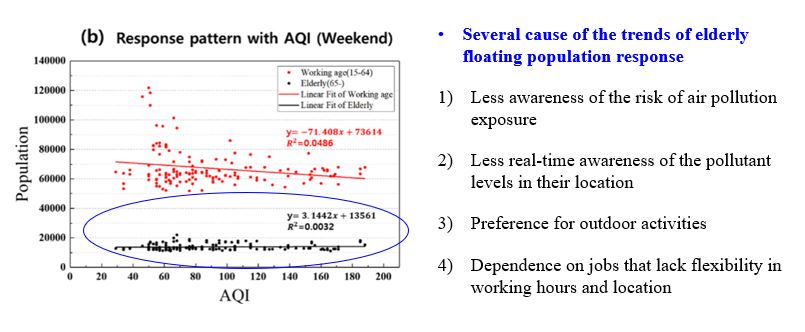

# ABSTRACT

Air quality plays a significant role in people’s respiratory health. In this paper, we use Air Quality Index (AQI) defined by the United States Environmental Protection Agency (USEPA) using 6 major air pollutants (PM10, PM2.5, CO, NO2, O3, SO2) for quantifying air quality. First, we calculated population-weighted exposure to air pollution for 9,123 neighborhoods in Seoul over four months, based on hourly floating population data derived from mobile network usage. We visualized these patterns using GIS software to identify areas with the highest active population exposure, separated by age group. Then, we analyzed air quality impacts on working age and elderly populations in the Yeouido district of Seoul, where both groups were highly exposed during this period. We found that the elderly population remained similar or even increased on highly polluted days (high AQI) compared to high reduction of population among working age groups. This response pattern suggests that elderly populations may not adjusting their behavior to avoid exposure to air pollution. For further research, a smaller scale of floating population is needed to distinguish whether people stay in buildings or not. In addition, Statistical tests would be conducted to verify AQI and human response among different age groups.
Keywords: Air quality index (AQI); Air pollution; Human exposure; Human response pattern 

# Material & Method 

### Method

# Result

# Conclusion 

In this research, we visualized Seoul’s population-weight exposure and found Yeouido-dong neighbourhood was the highest exposure place for both working age and elderly visitors to the area. Then, we analyzed the hourly population response pattern of working and elderly people when they were highly exposed to air pollution in Yeouido in 2018. As air pollution has become a serious issue in Korea, working age visitors were more likely to avoid the area during the most polluted times. On the other hand, floating populations of the elderly were less affected by air pollution, even though air pollution causes more serious health problems to the elderly. As the floating population does not distinguish whether people are inside of a building or outside, further research has to change the scale of floating population to smaller scale, to distinguish whether people stay in buildings or not. Furthermore, statistical tests need to be conducted to verify AQI and human response among different age groups.

# Acknowledgements
This work is financially supported by Korea Ministry of Land, Infrastructure and Transport(MOLIT) as 『Innovative Talent Education Program for Smart City』

# Reference

[https://koasas.kaist.ac.kr/handle/10203/269124](https://koasas.kaist.ac.kr/handle/10203/269124)
