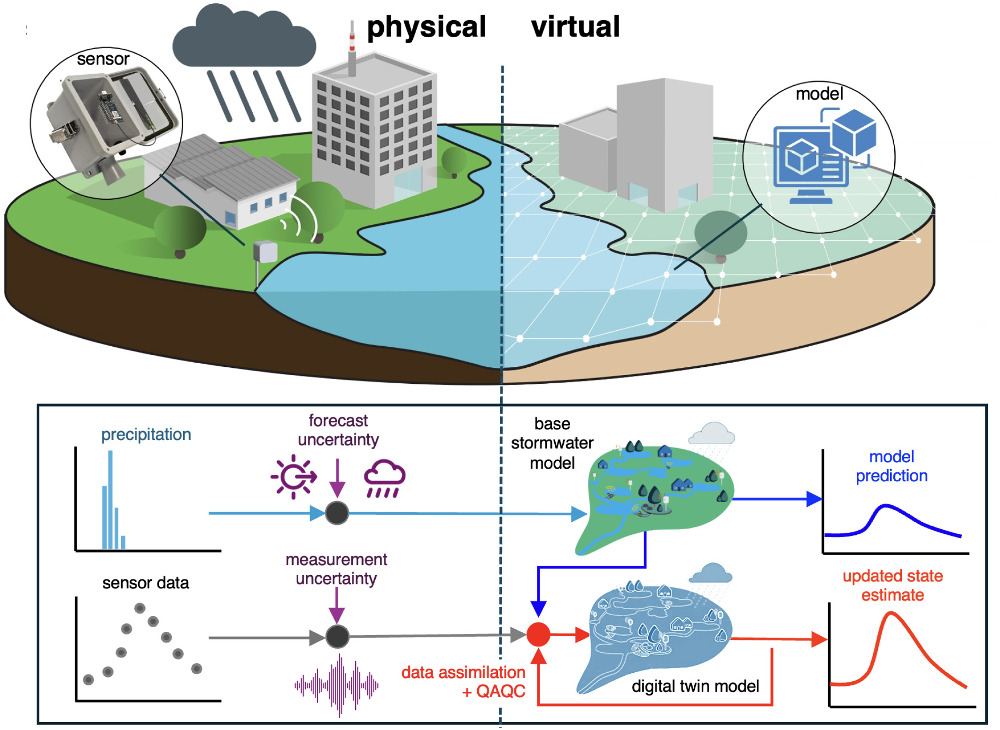
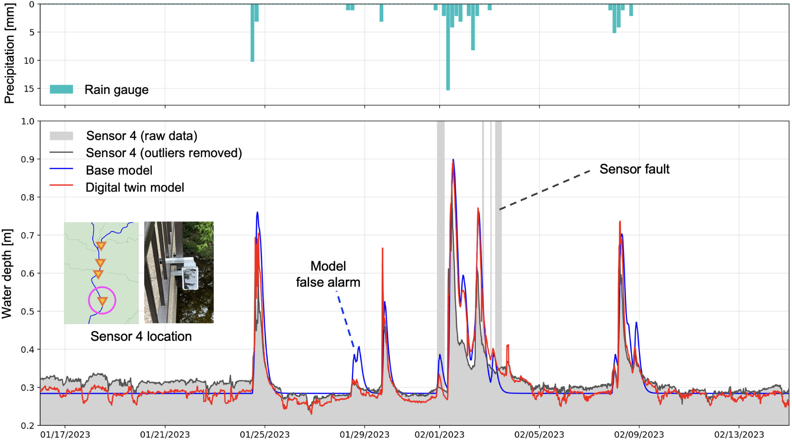

**Published:** *<b>Kim, Y.</b>, Oh, J., & Bartos, M. (2025). Sustainable Cities and Society, 105982.* [DOI →](https://doi.org/10.1016/j.scs.2024.105982)

# Overview

Urban drainage systems face growing flood hazards from climate change, while existing monitoring is complicated by **unreliable sensor data** and **imperfect hydrologic models**. This work introduces a **stormwater digital twin** that fuses real-time sensor data with a hydraulic-hydrologic model to estimate water depths and discharges under sensor and model uncertainty.

# Approach

- Developed a novel **Extended Kalman Filter (EKF)** state estimation scheme that simultaneously assimilates sensor data and detects faulty measurements
- Long-term real-world deployment in **Austin's Waller Creek watershed**
- Open-source Python software implementation enabling real-time monitoring and active control

# Key Results

- **ROC AUC > 0.99** for sensor fault detection — substantially reducing false flood alarms
- Improved water-depth estimation at **ungauged locations**
- More accurate **near-term flood forecasts** compared to a base hydraulic model
- Provides a complete framework for **rapid flood response, predictive maintenance, and active control** of sewer systems

# Reference

**Kim, Y.**, Oh, J., & Bartos, M. (2025). *Stormwater digital twin with online quality control detects urban flood hazards under uncertainty.* **Sustainable Cities and Society**, 105982. [https://doi.org/10.1016/j.scs.2024.105982](https://www.sciencedirect.com/science/article/pii/S2210670724008060)
