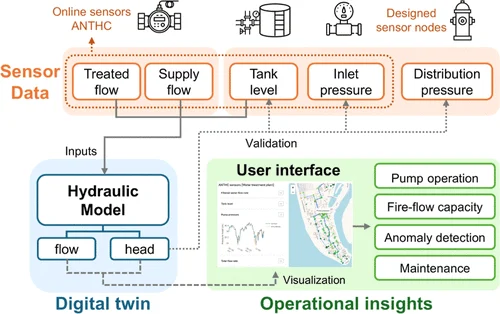
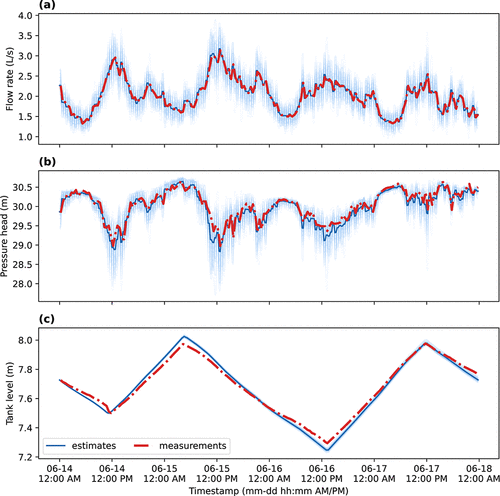

# From Field Data to Smart Operations
## A Digital Twin Framework for Water Distribution Systems in Remote Communities

**Published:** *Kim, Y., Huang, Y., Cantrell, R., Bartos, M., & Sela, L. (2026). ACS ES&T Water 6, 3543–3554.* [DOI →](https://pubs.acs.org/doi/10.1021/acsestwater.5c01515)

**Live Dashboard:** [Unalakleet WDS Digital Twin →](http://ec2-34-235-111-72.compute-1.amazonaws.com:5000/) (accessed 12 02, 2025)

# Abstract

Water distribution systems (WDSs) in remote communities often operate with limited staffing, aging infrastructure, and insufficient digital tools for monitoring and hydraulic modeling, requiring operators to rely heavily on experience for system management. This study develops an **end-to-end digital twin framework** for remote and resource-constrained water utilities and demonstrates its implementation in the WDS of **Unalakleet, Alaska** (~800 residents).

To enable continuous monitoring, we first design and deploy a **wireless sensor network** to collect pressure and temperature measurements throughout the WDS. We then develop a digital twin framework that combines monitoring data with a **dynamic hydraulic model** to continuously estimate pressures, flow rates, and tank levels. Validating the model against observations shows that it accurately reconstructs the hydraulic state using continuously updated monitoring data. Use cases demonstrate that the system can diagnose low-pressure events and assess impacts of **maintenance outages** and **fire-flow** scenarios on system pressures. To support operational use, we develop a **browser-based interface** with interactive time-series and geospatial visualizations for situational awareness and decision-making.

The workflow provides a **transferable template** for other remote or resource-limited communities seeking to digitalize their water systems.

# Wireless Sensor Network

We designed and deployed custom low-cost wireless sensor nodes across the four WDS loops (FAA, West, North, Southeast). Each node integrates:

- **EZO-PRS digital pressure sensor** (Atlas Scientific, 0–52 m range)
- **PT-1000 temperature probe** (–55 to 220 °C)
- Microcontroller, cellular module (2G/3G), battery, antenna
- **Solar panel** mounted externally for continuous energy harvesting

Sensors are housed in metal NEMA enclosures at hydrant fittings. Measurements are transmitted via I²C and cellular network to an **AWS EC2 instance**, where they are stored in an **InfluxDB** time-series database. Nodes were deployed during summer months (Jun–Oct 2024 and May–Oct 2025).

# Digital Twin Framework

The digital twin couples real-time sensor data with a hydraulic model of the Unalakleet WDS:

- **Hydraulic model**: built in INP format for compatibility with EPANET, WNTR, and epanet-js
- **Data assimilation**: at each time step, measured tank level defines hydraulic head, supply flows update time-varying demands, and pressures inform pump operation
- **Ensemble simulation**: stochastic demand perturbations propagate uncertainty into the predicted state
- **Validation**: Continuous Ranked Probability Score (**CRPS**) compares simulated and observed pressures/flows/tank levels

# Validation Results

The digital twin reconstructs the hydraulic state with high fidelity:

| Variable | CRPS |
|---|---|
| System pressure head | **0.065 m** |
| Tank level | **0.022 m** |
| Loop pressure (FAA) | 0.198 m |
| Loop pressure (West) | 0.393 m |

*Estimated and field measurements from ANTHC sensors (Jun 14–18, 2025): system flow, pressure head, and tank level.*

# Decision-Support Applications

Validated against real operations, the digital twin enables:

- **Anomaly detection** — early identification of unusual pressure or flow shifts (e.g., leaks, bursts, unauthorized use). Demonstrated on a pressure-drop event recorded in June 2025.
- **Outage & maintenance support** — risk-free testing of planned shutdowns; demonstrated on a Jun 2024 maintenance outage.
- **Fire-flow assessment** — capacity analysis under stressed demand conditions to support infrastructure planning.

# Web-Based Dashboard

An interactive Flask-based web interface integrates all components of the digital twin into a single platform — accessible without technical expertise:

- **Frontend**: Bootstrap layout, Plotly time-series charts, Leaflet network map
- **Backend**: Python pipeline retrieves sensor data, runs WNTR simulation, returns simulated estimates
- **Use**: operators select time windows and locations; nodal pressures and pipe flows update dynamically on the map

[**Open the live dashboard →**](http://ec2-34-235-111-72.compute-1.amazonaws.com:5000/)

# Reference

Kim, Y., Huang, Y., Cantrell, R., Bartos, M., & Sela, L. (2026). *From Field Data to Smart Operations: A Digital Twin Framework for Water Distribution Systems in Remote Communities.* **ACS ES&T Water**, 6, 3543–3554. [https://doi.org/10.1021/acsestwater.5c01515](https://pubs.acs.org/doi/10.1021/acsestwater.5c01515)
