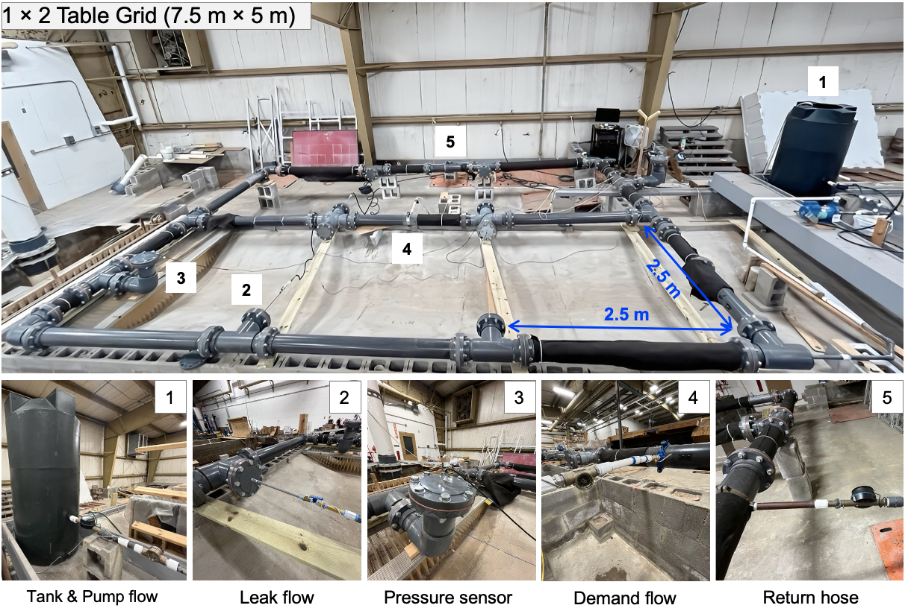

# Probabilistic Leak Detection in Water Distribution Systems
## Pilot-scale validation in Unalakleet, Alaska

# Abstract

This research develops a probabilistic framework for **leak detection, localization, and system diagnostics** in water distribution systems operating under uncertainty (pipe roughness, demand variability, hydraulic losses). The framework is deployed at a remote water distribution network in Unalakleet, Alaska — a community of ~740 residents with 4 distribution loops — and combines:

- **Python-based hydraulic modeling and data assimilation** using EPANET for network-wide state estimation and continuous monitoring
- **SCADA API integration** with wireless pressure sensors and adaptive sampling, within an AWS-based data pipeline
- **Probabilistic inference** for leak detection and localization, accounting for uncertainty in model parameters and field conditions
- **Operational decision-making** support for pump scheduling and valve control, validated against pilot deployment data

The system enables continuous monitoring, anomaly detection, and data-driven operational decisions for utility operators managing distribution networks under uncertainty.

# Status

Manuscript under preparation: *Kim, Y. & Bartos, M. (2025). Probabilistic parameter-estimation framework for discovery of pre-existing leaks in water distribution systems* (target: Water Research).
