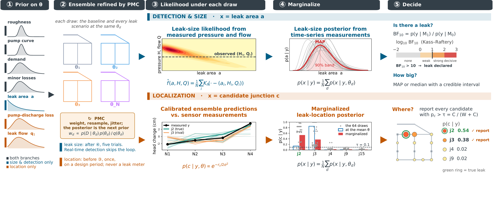

Model-based leak detection and localization compares measured pressure with model-predicted pressure. Parametric error in roughness, base demand, pump curve, and minor losses typically exceeds the leak-induced head change, so the residual is dominated by model error rather than by the leak. Conventional practice is to calibrate a few coefficients by hand. This framework replaces that step with ensemble calibration and marginalization.

Detection, size estimation, and localization are not stages of a workflow. They are the same pipeline instantiated on a different inference target: the prior, the calibrated ensemble, and the marginalization step are shared, and only the likelihood and the decision rule change.

# The shared pipeline

**Prior.** θ collects roughness, base demand, pump curve, and minor losses, plus the leak parameters of whichever analysis is running. Priors are broad and independent.

**Ensemble.** *N* draws θ*d* from the prior. Each draw simulates the baseline and every leak scenario under the same θ*d*, so a leak signature and its baseline carry a common model error that differencing removes.

**Population Monte Carlo.** Importance weights against pressure sensors and the metered system inflow, followed by resampling and jitter, with the posterior serving as the next proposal:

<code>wd &prop; p(D &#124; &theta;d) p(&theta;d) / q(&theta;d)</code>

Leak flow meters are never read; the leak flow enters as a parameter to be estimated.

**Marginalization.** The target is averaged over the calibrated ensemble rather than evaluated at a point estimate:

<code>p(x &#124; y) = (1/N) &Sigma;d p(x &#124; y, &theta;d)</code>

Hydraulics are solved with [pipedream](https://github.com/mdbartos/pipedream), which integrates the Saint-Venant equations with a Preissmann slot for pressurized flow.

# The two instantiations

|  | Detection and size | Localization |
|---|---|---|
| Target *x* | leak area *a* | candidate junction *c* |
| Observations | pump flow and pressure, as a time series | tap pressures and the metered system inflow |
| Likelihood | kernel density estimate over the ensemble samples of leak area, pressure, and flow, conditioned on the observation at each time step and accumulated across the series <code>f&#770;(a,H,Q) = (1/N) &Sigma;i Kh( &middot; &minus; (ai,Hi,Qi) )</code> | a fingerprint catalogue per draw, the head change at the taps for a leak at each candidate; common mode removed and a leak scale fitted per candidate, so only shape is compared, leaving a residual *r**c* in units of sensor noise <code>p(c &#124; y, &theta;) &prop; exp( &minus;rc / 2&sigma;2 )</code> |
| Decision | Bayes factor on the Kass-Raftery scale, a leak declared at BF10 &gt; 10; size as the MAP or median with a credible interval <code>BF10 = p(y &#124; M1) / p(y &#124; M0)</code> | every candidate above a cost-ratio threshold is reported, with *C* the cost of a crew visit and *W* the cost of a missed leak; the posterior also yields a credible set over junctions <code>&tau; = C / (W + C)</code> |
| PMC schedule | five trials after marginalization; real-time detection skips the loop and runs on the prior ensemble | once on a design period, before the catalogue is built; parameters, thresholds, and ensemble are then fixed |

# References

- **Kim, Y.** & Bartos, M. *Probabilistic parameter-estimation framework for discovery of pre-existing leaks in water distribution systems.* In preparation (target: Water Research).
- **Kim, Y.** & Bartos, M. (2026). *Uncertainty-Aware Leak Detection and Localization in Water Distribution Networks.* Poster, WEFTEC 2026.

Supported by the National Science Foundation under Grant 2220516.
